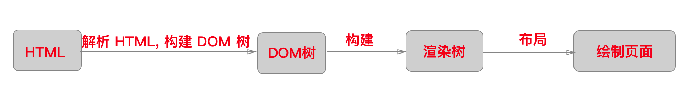
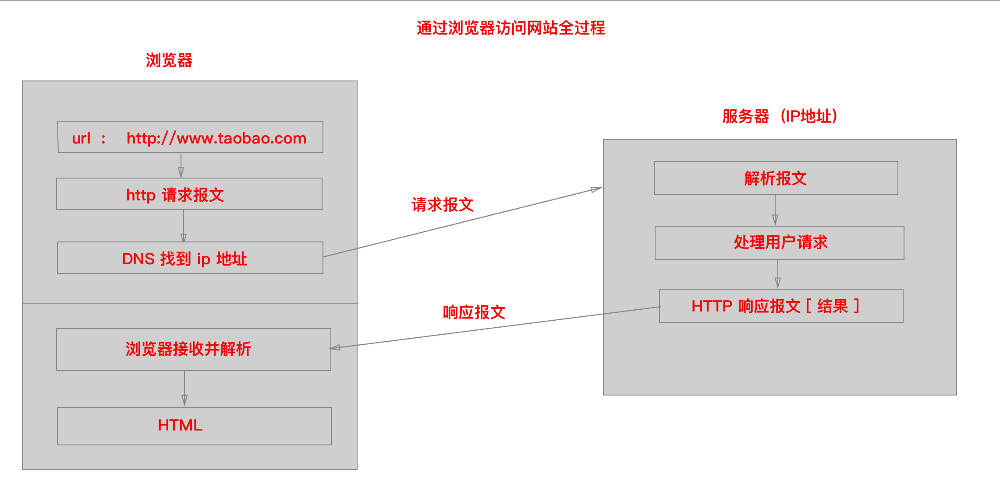

### Node 第一天课程安排

1. 浏览器的工作原理;
2. Node.js 的简单介绍
3. 创建  node.js 程序 打印:hello world ;
4. 事件循环;
5. 读取写入文件;
6. 使用 Node.js 创建一个极简服务器


###☆ 准备知识 (了解知识)

> 1. 浏览器的组成
> 2. 浏览器的渲染引擎 和 工作原理
> 3. 访问网站的过程
> 4. ...

#### 1. 浏览器的组成 

- ##### 用户界面 ( User Interface )

  - 包括地址栏、前进/后退、书签菜单等

  - 除了浏览器主窗口显示的你请求的页面外,其他显示的各个部分都属于用户界面

    ​

- ##### 渲染引擎（ Rendering engine )

  - 负责显示请求的内容。

  - 如果请求的内容是 HTML, 它就负责解析 HTML (如果有样式,也顺便解析CSS 内容),并将解析后的内容显示在屏幕上。

    ​

- ##### 浏览器引擎（ Browser engine ）

  - 在用户界面和渲染引擎之间传达指令。(比如: 点击刷新...)

    ​

- ##### 网络模块（Networking）

  - 用户网络调用。

  - 例如http请求，它具有平台无关的接口，可以在不同平台上工作

    ​

- ##### UI 后端 ( UI Backend)

  - 用户绘制基本的窗口小部件, (比如:对话框、弹窗等)。

  - 具有不特定于某个平台的通用接口，底层使用操作系统的用户接口

    ​

- ##### JS 解释器  ( JavaScript Interpreter )

  - 用来 解析 和 执行  JS 代码 。(比如chrome的javascript解释器是: js V8引擎)

  - ```
    v8引擎: 它是谷歌研发的一种解析引擎,效率很高
    为什么会? 是因为自身的高级语言和内存策略决定的
    - 高级语言: 使用了偏底层的  C/C++, 它自身执行效率很高
    - 内存策略: 一切在运行堆栈里,无用的数据都会被强行回收,从而可以大大提高 js 代码的运行效率
    - 还有使用缓存等等其他技术吧
    ```

  - ​

- ##### 数据存储  ( Data Persistence  )  

  - 属于持久层

  -  Cookie、HTML5中的本地存储 LocalStorage、SessionStorage）(setItem/getItem)

  -  Cookie:  每次http请求都会携带Cookie 这个 字, 根据这个字段可以在两个页面之间进行传值,大小不超过4k;

  -  LocalStorage 和 SessionStorage  主要是因为生命周期长短不同  最好不要超过5M 

    - SessionStorage  : 关闭浏览器就清除数据
    - LocalStorage:  需要手动清除缓存啊

  -  [区别](http://blog.csdn.net/xtzz92/article/details/51668644)

    ​

   

#### 2. 浏览器渲染引擎工作原理 

2.1  **渲染引擎** 又叫 排版引擎 或 浏览器内核。—> 作用 : 用来渲染显示页面

2.2  主流的 **渲染引擎** 有

- **Chrome浏览器**: Blink引擎（WebKit引擎的一个分支）。  `拿出来,丰富了优化了`
- **Safari浏览器**: WebKit引擎。
- **FireFox浏览器**: Gecko引擎。
- **Opera浏览器**: Blink引擎 (早期版使用Presto引擎）。
- **Internet Explorer浏览器**: Trident引擎。
- **Microsoft Edge浏览器**: EdgeHTML引擎（Trident的一个分支）。

##### 2.3  渲染引擎的工作原理

1. **解析 HTML 构建 DOM 树** ( Document Object Model, 文档对象模型 )。DOM 是W3C组织推荐的处理可扩展置标语言的标准编程接口。

2. **构建渲染树**。渲染树并不等同于 DOM 树,因为像`head标签 或 display: none`这样的元素不需要渲染的,故就没有必要放到*渲染树*中了，但是它们在*Dom树*中。

3. **对渲染树进行布局**。 定位坐标和大小、确定是否换行、确定position、overflow、z-index等等，这个过程叫`"layout" 或 "reflow"`。

4. **绘制渲染树**。调用操作系统底层 API, 进行绘制操作

   ​

   **[渲染引擎的工作原理图 : ]**

 

 

##### WebKit工作原理（Chrome、Safari、Opera）

 

##### Gecko工作原理（FireFox）

 

#### 3. 通过浏览器访问网站的全过程

> 演示: www.baidu.com

3.1 在浏览器地址栏中输入网址。

3.2 浏览器通过用户在地址栏中输入的URL构建HTTP请求报文。

```json
GET / HTTP/1.1
Host: www.taobao.com
Connection: keep-alive
Upgrade-Insecure-Requests: 1
User-Agent: Mozilla/5.0 (Windows NT 10.0; Win64; x64) AppleWebKit/537.36 (KHTML, like Gecko) Chrome/57.0.2987.133 Safari/537.36
Accept: text/html,application/xhtml+xml,application/xml;q=0.9,image/webp,*/*;q=0.8
Accept-Encoding: gzip, deflate, sdch, br
Accept-Language: zh-CN,zh;q=0.8,en;q=0.6
Cookie: l=Ag0NWp9E8X4hgaGEtIBhOmKxnSOH6kG8; isg=AkZGLTL-Yr9tHDZbgd5bsn4Rlzwg5IphaK-1BzBvMmlEM-ZNmDfacSyDfdgF; thw=cn
```

3.3 浏览器发起DNS解析请求，将域名转换为IP地址。

> DNS（Domain Name System，域名系统），因特网上作为域名和[IP地址](https://baike.baidu.com/item/IP%E5%9C%B0%E5%9D%80)相互映射的一个[分布式数据库](https://baike.baidu.com/item/%E5%88%86%E5%B8%83%E5%BC%8F%E6%95%B0%E6%8D%AE%E5%BA%93)，能够使用户更方便的访问[互联网](https://baike.baidu.com/item/%E4%BA%92%E8%81%94%E7%BD%91)，而不用去记住能够被机器直接读取的IP数串。通过[主机](https://baike.baidu.com/item/%E4%B8%BB%E6%9C%BA)名，最终得到该主机名对应的IP地址的过程叫做域名解析（或主机名解析）

3.4 浏览器将请求报文发送  到对应IP地址服务器。

3.5 服务器接收请求报文,并解析。

3.6 服务器处理用户请求,并将处理结果封装成 HTTP 响应报文。

```js
HTTP/1.1 200 OK
Server: Tengine
Date: Thu, 13 Apr 2017 02:24:25 GMT
Content-Type: text/html; charset=utf-8
Transfer-Encoding: chunked
Connection: keep-alive
Vary: Accept-Encoding
Vary: Ali-Detector-Type, X-CIP-PT
Cache-Control: max-age=0, s-maxage=300
Via: cache8.l2cm10-1[172,200-0,C], cache13.l2cm10-1[122,0], cache3.cn206[0,200-0,H], cache6.cn206[0,0]
....
```

3.7 服务器将 HTTP 相应报文发送给浏览器

3.8 浏览器接收服务器相应的 HTTP 响应报文,并解析。

3.9 浏览器解析 HTML 页面并展示。 

####4.DNS 解析过程

  

####5. DOM 解析

参考代码: 

```html
<html>
  <body>
    <p>Hello World</p>
    <div> </div>
  </body>
</html>
```


 


####6. Webkit CSS 解析

 


---

### 关于C/S（Client/Server） 和 B/S（Browser/Server）— 架构模式

> C/S 模式：是客户端/服务器(Client/Server)模式，主要指的是传统的桌面级的应用程序。比如手机端上的微信, PC端上火车站售票员的售票软件。
>
> B/S模式：是浏览器/服务器(Browser/Server)模式，主要指的是浏览器访问服务器，就像平常使用的电子商务网站，如淘宝网页，京东网页等。
>
> 相对于C/S模式的应用程序来说，B/S模式最大的优势在于客户端只要有浏览器就可以运行。而C/S模式的应用程序需要在客户端进行安装，而且升级也不太方便。而B/S模式的应用程序对于客户端来说，永远都是最新版本的。


#### 处理响应

- 服务器响应完毕后,客户端如何继续处理
  - B/S模式 :   由浏览器 解析服务器返回的数据
  - C/S 模式: 由 iOS、Android 客户端,解析服务器返回的数据,并且通过iOS 和 Android的 UI技术实现界面的展示功能。


## 补充链接:

## How Browsers work - 浏览器是如何工作的

[How Browsers work](http://taligarsiel.com/Projects/howbrowserswork1.htm#The_browsers_we_will_talk_about)
https://www.html5rocks.com/zh/tutorials/internals/howbrowserswork/


#### MDN

- [中文版](https://developer.mozilla.org/zh-CN/)


- [英文版](https://developer.mozilla.org/en-US/):

​      一个前端程序员交流学习、查询 API文档 的网站.  推荐指数 :  ★★★★★

