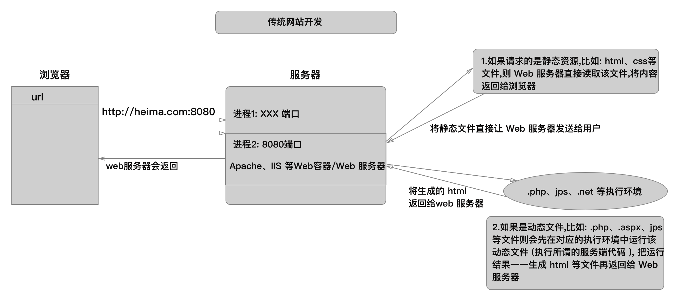
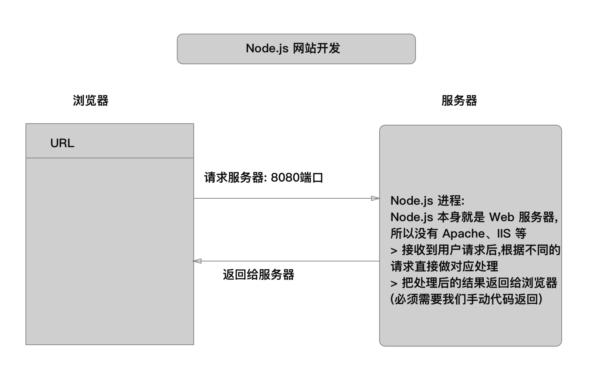
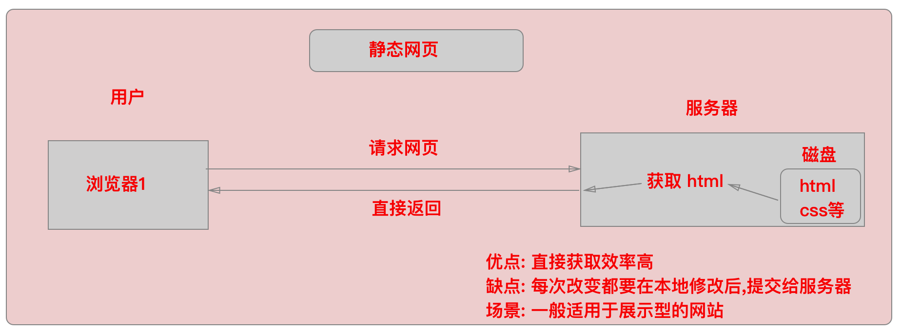
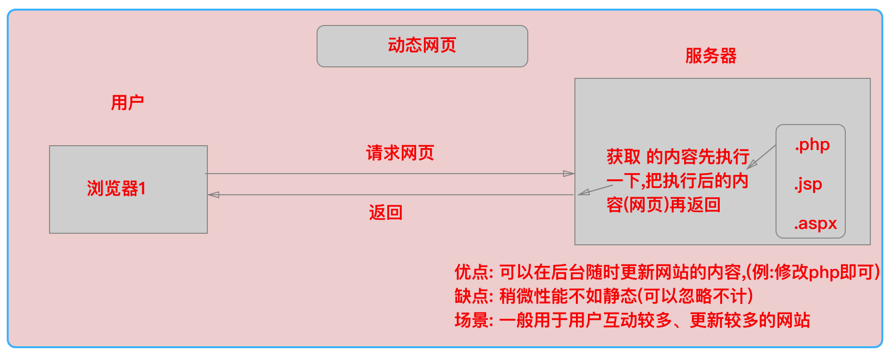

## Node 介绍

###  node 是什么 ?

0. node 具有很多别名: Nodejs、NodeJS、Node.js 、node.js 等


1. node 是一个开发平台, 就像 Java 开发平台、.Net 开发平台、PHP 平台、Apple 开发平台一样。
   - 何为**开发平台?** 有对应的编程语言、有语言运行时、有能实现特定功能的 API (例如: fs http)
2. 该平台使用的编程语言:  javascript 语言。
3. node.js 平台是基于 Chrom V8 javascript 引擎构建 (简称: V8 引擎)。
4. 基于 node.js 可以开发控制台程序（命令行程序）、桌面应用程序（GUI）（借助 node-webkit、electron 等框架实现）、Web 应用程序（网站）

### node 有哪些特点

1. 事件驱动 ( 事件触发,会执行回调函数里的代码 )

   - js 也是事件驱动, 鼠标放置,点击,不同的事件触发不同的代码
   - node.js 是传一个回调函数

2. 非阻塞 I/O (I/O)

   - I/O 就是输入输出操作


   - 读写 I/O + 网络 I/O

   -  nodejs 的 I/O , 不会阻塞程序

   - ```js
     console.log(111);
     fs.readFile(function(data){
       console.log(data,222);
     })
     console.log(333);
     ```

   -  不会阻塞我们主程序的运行

3. 单线程;

   - 首先我们 js 就是单线程的语言, node基于 js 也是单线程;
   - 减少内存开销 (线程/2M)

4. 拥有世界最大的开源生态系统-- npm

   - npm - 开源库托管网站! [官网](https://www.npmjs.com/)

   - 我们 node是一个开发平台有 实现特定功能的 api, 但是内置的 api 是有限的,,想要实现 node.js 自己实现不了的功能怎么办 ?? 就去找 npm,,

   - 只要是我们想到的功能,都已经有人帮我们已经写好了,就在 npm 这个代码仓库里,,,

   - npm 这个丰富的开源系统,,而且也很开放, 每个人也都会写模块,,然后把代码上传到 npm 上,供大家使用

   - 就像 jquery 一样,很多人都给它写插件啊,,给她拓展功能啊,

   - 我们 node.js 也是,,,, npm 里面帮我们提供了各种各样的功能

     ​


### node 官方网站

1. [node.js官方网站](https://nodejs.org/) :  https://nodejs.org/
2. [node.js中文网](http://nodejs.cn/)     :  http://nodejs.cn/

### node.js 学习资源

1. 图书

- 《深入浅出Node.js》 作者：朴灵

1. 网站资源

- [CNODE社区](https://cnodejs.org/) 
- [Node.js 简易教程](http://www.runoob.com/nodejs/nodejs-tutorial.html)
  - [Node入门](https://www.nodebeginner.org/index-zh-cn.html)
  - [Node.js包教不包会](https://github.com/ppker/node-lessons)
  - [CNODE-新手入门](http://cnodejs.org/getstart)
  - 其他参考链接
    - [Node.js 究竟是什么？](https://www.ibm.com/developerworks/cn/opensource/os-nodejs/index.html)
    - [Node.js是用来做什么的？](https://www.zhihu.com/question/33578075)
    - [什么是 node.js](http://www.infoq.com/cn/articles/what-is-nodejs)

1. Node.js 使用场景 & 实战

- [Node.js雪球实战半年谈](http://www.undozen.com/slides/xueqiu2012a/#21.1)
- [雪球上的 Node.js](http://mengxy.net/slides/nodejs-at-xueqiu/)
  - [国内有哪些网站使用了 Node.js](https://cnodejs.org/topic/50613e6601d0b8014822b6b9)
  - [Node.js & Uber](https://www.joyent.com/blog/node-js-office-hours-curtis-chambers-uber)
  - [Node.js 的优势和劣势](https://www.zhihu.com/question/19653241)
  - [node.js的15个应用场景](http://www.devstore.cn/essay/essayInfo/2199.html)
  - [How to decide when to use Node.js?](https://github.com/simongong/js-stackoverflow-highest-votes/blob/master/questions1-10/when-to-use-nodejs.md)
  - [优缺点及适用场景讨论](http://www.cnblogs.com/sysuys/p/3460614.html)
  - [Node.js 发展前景如何？适用于哪些场景？](https://www.zhihu.com/question/19587881)
  - [Node.js企业开发 一应用场景](http://n.thepana.com/2014/01/06/node-yingyong-changjing/)
  - [10个最佳Node.js企业应用案例：从Uber到LinkedIn](http://www.sohu.com/a/150175393_465223)
  - [极速Node.js：来自LinkedIn的10个性能提升秘籍](http://blog.jobbole.com/40135/)
  - 为分布式应用做中转
  - 前后端团队融合，节省成本
  - Node.js 简单高效
  - Node.js 是给前端用的，后端复杂的业务逻辑肯定不会用 Node.js


### 为什么要学习 Node.js

1. 技多不压身, 提高自身竞争力 ——> money  [智联招聘](http://sou.zhaopin.com/jobs/searchresult.ashx?jl=%E4%B8%8A%E6%B5%B7&kw=node&p=1&isadv=0)

2. 通过学习 Node.js 开发 **深入理解服务器开发**、**Web 请求和响应过程**、**了解服务器端如何与客户端配合**

3. 现在前端工程师**面试**,对 Node.js 开发有要求

4. 后期学习 vue、webpack、React 都要用到 !  

   ​

### Node.js安装和配置

1. 下载地址

- [当前版本](https://nodejs.org/en/download/)
- [历史版本](https://nodejs.org/en/download/releases/)

2. 官网术语解释

- LTS 版本：Long-term Support 版本，长期支持版，即**稳定版**。(不要当第一个吃螃蟹的人)
- Current 版本：Latest Features 版本，最新版本，新特性会在该版本中最先加入。 (不推荐使用)

3. 注意：

- 安装完毕后通过命令：`node -v`来确定是否安装成功【注意：打开"命令窗口"的时候建议使用"管理员方式"打开】
- 顺便查看一下 npm : `npm -v`  [注意: 不要使用 5.0+以上的 npm 版本]
- 如果确定安装了,但是查不到版本,需要配置环境变量: 此电脑右键-> 属性-> 高级系统设置-> 环境变量,把路径加上即可


### Node.js 开发 web 应用程序 和 PHP 、Java、.Net 等传统模式开发 web 应用程序区别

1. 传统模式开发

    

2. Node.js 开发 

    

3. 补充提问:   什么是动态网页 ? 什么是静态网页? 

   - 静态网页: 当有用户请求服务器获取网页的时候,服务器从磁盘中读取网页的内容,把这个内容直接返回给用户;

   - 动态网页: 当有用户请求服务器获取网页的时候,不是直返回给用户,而且现在服务器里先执行一下,(比如 php,,先执行 php, 然后返回一个 html 网页, 具体说执行 php 干嘛,我们不管,,,具体情况具体看待…);

      (比如:谁访问的页面,就显示,你好 XX)

       


客户端渲染   服务器端渲染


