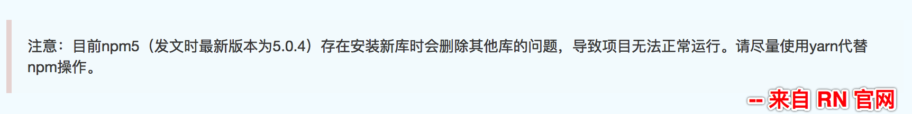

# NPM - Node Package Manager - Node包管理器

## NPM 是什么？

- npm（全称Node Package Manager，即node包管理器）是Node.js默认的、以JavaScript编写的软件包管理系统。

- [npm 官方网站 ](https://www.npmjs.com/)   

- https://npm.js.cn/

  >  *mime*

- [npm 官方文档](https://docs.npmjs.com/)


## NPM 官方解释：

- npm is the package manager for JavaScript and the world’s largest software registry.
  - npm 是一个JavaScript包管理器，并且是世界上最大的软件登记处
- discover packages of reusable code — and assemble them in powerful new ways.
  - 发现可重用代码，并集成代码包到项目中的全新的、强大方式


- npm makes it easy for JavaScript developers to share and reuse code, and it makes it easy to update the code that you're sharing.
  - npm 让JavaScript开发者共享和重用代码变的更容易，同时也让我们更容易地更新正在被共享的代码


## npm与 node.js

- npm是Node.js默认的软件包管理系统。安装完毕node后，会默认安装好npm
- npm本身也是基于Node.js开发的包


## 如何安装 NPM?

- 安装完毕node.js后会自动安装npm

- 查看当前npm版本：`npm -v `   

  > 目前 node 最新是 9.0.0版本  稳定版是8.9.0版本 
  >
  > npm 对应的是  5.5.1 版本 了

- 更新 npm：`npm i npm@latest -g`       `i 就是 install, 用哪个都行`

  ```js
  //更新最新的 npm 
  // npm i npm -g   //  --global
  // npm i npm@latest -g 
  // npm i npm@9.0.0  -g
  ```

  ​

- 降级 npm:  `npm i npm@3.10.10 -g    // @后面写具体版本`    

  

- ```js
   Counld not found '..' from node modules 
   //1. 删除 node modules   -> npm i 
   //2. npm 降低
   //3. yarn add 
  ```

- ​

## NPM 使用

1. 在 https://www.npmjs.com/ 网站找到需要的包

2. 在项目的**根目录**下，执行`npm install XXX`安装 (不推荐)

3. 通过 `require('包名');` 加载该模块

4. 注意：通过`npm install 包名`安装的包，会自动下载到当前目录下的`node_modules`目录下，如果该目录不存在，则创建，如果已存在则直接下载进去。

   ```js
   以后从网上下载别人的源码,如果运行不起来并提示找不到modules ,`Error: Cannot find module 'mime'...`
   查看一下node_modules在不在,
   如果不在,在根目录下 , shitf+ 右键打开终端: 执行:npm i
   ```

​     ----- 上面说的这种方式叫做 本地安装。


## NPM 全局安装介绍

1. 什么是 npm 全局安装？

- `npm install 包名 -g   (--global)`  
-  npm 全局安装指的是把包安装成了一个命令行工具。(全局使用其命令)

```javascript
  // 通过npm全局安装mime
  npm install mime -g

  //安装完毕后可以在命令行中直接使用
  mime a.txt 命令来查看对应的结果
```


## npm常用命令介绍

1. npm —> 可以查看一些信息 

2. install ==i ，安装包。`npm install 包名 `  或者  `npm i 包名`

3. uninstall，卸载包。`npm uninstall 包名`   `// npm un 包名`

4. version，查看当前npm版本。`npm version` 或 `npm -v`

5. init，创建一个package.json文件。`npm init`  (不推荐),   `npm init -y ` (推荐)

   ```js
   npm init -y 使用的注意点:
   1. 文件夹名不能有中文
   2. 也不能有空格
   ```

   - Package.json 的作用:  保存安装记录, 下次安装的时候,根据记录直接安装`依赖`的包


   - 注意：不要使用中文做项目名称; 否则会创建失败

6. —save == -S  :  把下载名称保存在 package.json 里的 `dependencies`

7. —save —dev  == -SD  == -D :  把下载名称保存在 package.json 里的 `devDependencies`   (开发阶段)

   ​

####开发常见使用:

```js
// 创建 包的配置文件
npm init -y
// 查看版本
npm -v
// 全局安装包
npm i 包名 -g
// 本地安装包
npm i 包名 -SD/-S
```


## "模块"（Modules）和"包"（Packages）的区别

1. A **module** is any file or directory that can be loaded by Node.js' `require()`. 

- 模块可以是任何一个文件或目录（目录下可以有很多个文件），只要能被node.js通过require()即可。
- 在 node 的世界里,每一个文件都是一个模块;

2. A **package** is a file or directory that is described by a `package.json`. This can happen in a bunch of different ways!

- 包是一个文件或目录（目录下可以有多个文件）必须有一个package.json文件来描述，就可以是一个包。
- 总结: 模块包括包.


#### 补充: 

node.js 错误调试：

1. 当开启服务后，在浏览器中输入地址，如果出现浏览问题，首先要先看 服务器控制台是否报错。如果报错，直接根据服务器报错进行排错。
2. 打开浏览器开发者工具中的 “网络” 部分，查看请求是否成功发出去了

- 看一下请求报文是不是和我们想的一样
- 响应状态码


#### 淘宝镜像:

```js
//淘宝镜像
npm config set registry https://registry.npm.taobao.org

//检测是否设置成功
npm config get registry
```


### cnpm

```
1. npm 安装 cnpm  
   npm i cnpm -g
2. 检查  cnpm   
    cnpm -v
3. 安装其他包:
   cnpm  i bootstrap -S
```


### yarn

```
1. npm 安装 yarn  
   npm i yarn -g
2. 检查  yarn   
    yarn -v
3. 安装其他包:
   yarn add underscore 
```


