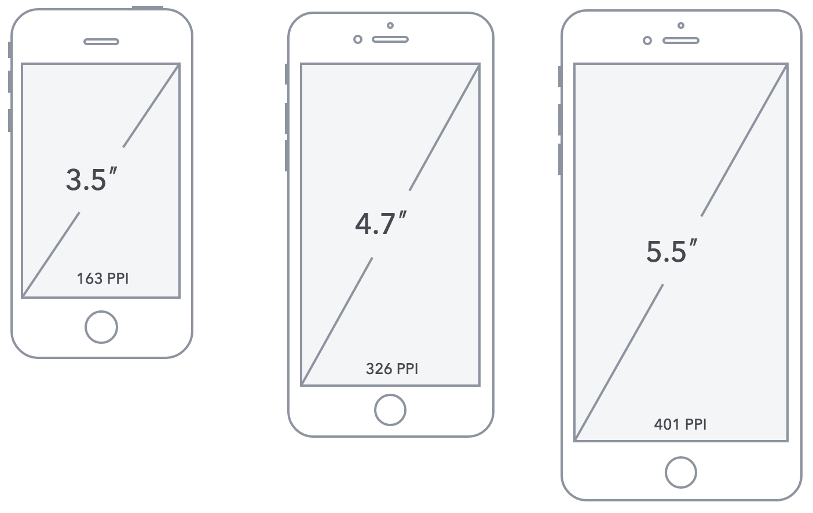
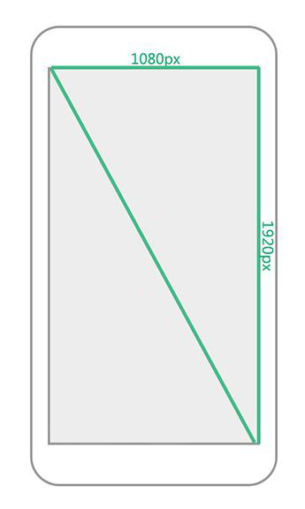
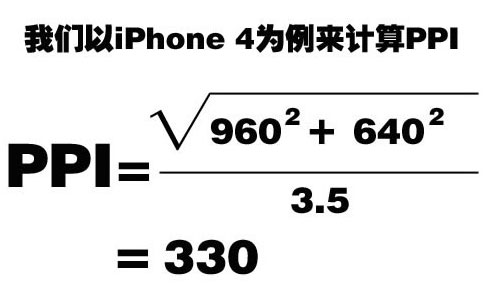

# 移动web基础

## 移动端开发分类

+ 原生app（native app）
+ 混合app（Hybrid app）
+ web应用（webApp）

**原生app（native app）**

原生app是基于操作系统的开发，比如安卓，ios，windows phone,他们只能在各自的操作系统上运行。

优点：

1. 可以访问操作系统，获取更多的资源（gps，摄像头，传感器，麦克风等）
2. 速度快，性能高，用户体验好
3. 可以离线使用

缺点：

1. 开发成本高
2. 需要安装和更新，更新与发布需要审核。

**混合app（Hybrid App）**

使用H5C3开发页面，打包成不同平台的应用（ipa，apk等）

优点：

1. 更新更加方便
2. 开发成本更低，兼容多个平台
3. 也可以访问手机的操作系统资源。

缺点：

1. 用户体验相比原生app稍差。
2. 性能依赖于网速

**Web App**

Web应用使用H5C3开发页面，为浏览器设计的基于web的应用，可以在各种智能设备的手机浏览器上运行。

优点：

1. 支持设备广泛
2. 开发成本低
3. 可以随时上线与更新，无需审核

缺点：

1. 用户体验极度依赖网速
2. 要求联网


总结：

三种开发各有优缺点，具体用什么需要根据实际情况而定，比如预算，app注重功能还是内容等。


## 屏幕与分辨率

> 移动设备与PC设备最大的差异在于屏幕，这主要体现在屏幕尺寸和屏幕分辨率两个方面。

### 屏幕尺寸

通常我们所指的屏幕`尺寸`，实际上指的是屏幕对角线的长度（一般用英寸来度量）如下图所示




### 屏幕分辨率

分辨率则一般用像素来度量，表示屏幕水平和垂直方向的像素数，例如1920*1080指的是屏幕垂直方向和水平方向分别有1920和1080个像素点而构成，如下图所示,分辨率越高，越清晰。



`像素`：指计算机显示设备中的最小单位，即一个像素点的大小。

像素是相对长度单位，在屏幕分辨率越高的设备，像素点越小，屏幕分辨率越低，像素点越大。


### 像素密度ppi(了解)

`PPI（Pixels Per Inch）`值来表示屏幕每英寸的像素数

利用 *勾股定理* 我们可以计算得出PPI




PPI值的越大说明单位尺寸里所能容纳的像素数量就越多，所能展现画面的品质也就越精细，反之就越粗糙。

**结论：当PPI 越大，展示的画质越精细。**


## 设备独立像素

> 随着技术发展，设备不断更新，出现了不同PPI的屏幕共存的状态,给我们开发带来的

做为用户是不会关心这些细节的，他们只是希望在不同PPI的设备上看到的图像内容差不多大小，所以这时我们需要一个新的单位，`这个新的单位能够保证图像内容在不同的PPI设备看上去大小应该差不多`，这就是独立像素,也叫（设备无关像素），在IOS设备上叫`PT`，Android设备上叫`DP`，在css中，叫`PX`。

获取设备的像素比

```javascript
window.devicePixelRatio  //物理像素与独立像素的比值
```

## 2倍图与3倍图（重要）

> 以后同学在工作的过程中，从UI那拿到的设计图通常都是640的设计图或者是750的设计图.

把更多的像素点压缩至一块屏幕里，从而达到更高的分辨率并提高屏幕显示的细腻程度。


设备像素比devicePixelRatio：即像素的压缩比例

**结论 ：在移动端为了在高清屏手机上显示得更加细腻，通常会使用更大的图片，比如2倍图或者3倍图。**

【演示：2倍图】

## 视口viewport（重要）

```javascript
问题：一个电脑上的网站，在手机端访问，效果是什么样的？

iPhone5的设备宽度只有320px，一张宽度为640px的图片在手机端访问，显示的效果是什么？

1. 在手机端，html的大小都是980px，为什么？
这主要是历史原因导致的，因为在移动设备刚流行的时候，网站大多都是pc端的，pc端的页面宽度一般都比较大，移动设备的宽度比较小，如果pc端页面直接在移动端显示的话，页面就会错乱。为了解决这个问题，移动端html的大小直接就定死成了980px（因为早起的pc端网站版心就是980px居多）。

2. 视口
在pc端，html的大小默认是继承了浏览器的宽度，即浏览器多宽，html的大小就是多宽，但是在移动端，多出来了一个视口的概念（乔布斯）,视口说白了就是介于浏览器与html之间的一个东西，视口的宽度默认定死了980px，因此html的宽度默认就是980px，视口的特点是能够根据设备的宽度进行缩放。

3. 视口设置。
对于现在的移动端页面来说，视口默认为980px肯定不合适，因为设备宽度不够的话，视口会进行缩放，导致页面展示效果不好看。
```

**视口参数设置**

```javascript
//width 设置视口的宽度
//width=device-width   设置视口宽度为设备的宽度（常用）。

//initial-scale 设置初始缩放比例
//initial-scale=1.0  表示不缩放

//user-scalable 设置是否允许用户缩放
//user-scalable=no  不允许用户缩放

//maximum-scale  设置允许的最大缩放比例
//maximum-scale=1.0  可以不设置，因为都禁止用户缩放了。

//minimum-scale 设置允许最小缩放比
//minimum-scale=1.0  不设置，因为都禁用用户缩放了。


//标准写法：
//快捷键：  meta:vp + tab键
<meta name="viewport" content="width=device-width, user-scalable=no, initial-scale=1.0">
```

## 移动端调试问题

1. 模拟器调试
2. 真机调试：使用手机进行访问。

手机设备五花八门，屏幕尺寸都大不一样，尤其是安卓端，给我们的页面预览带来了一些麻烦。在实际工作中，作为开发者不可能有足够的设备让我们去测试（**除了测试部门** ），即便有，效率也特别的低，因此开发者一般都是通过浏览器的手机模拟器来模拟不同的设备。


# 流式布局

**移动端的特点**

- 手机端的兼容性问题比PC端小很多，因为手机端的浏览器版本比较新
- 手机端屏幕比较小，能够放的内容比较少。

问题：布局的时候怎么解决屏幕大小不一致的问题？

- PC端，固定版心，让所有分辨率的电脑的版心都是一样的，比如京东
- 移动端：移动端无法设置版心，因为移动端的设备屏幕本身就小，设置版心不合适。因此移动端大多会采用流式布局（百分比布局）


**流式布局**，也叫百分比布局，是移动端开发中经常使用的布局方式之一。

流式布局的特征：

- 宽度自适应，高度写死，并不是百分百还原设计图
- 图标都是固定死大小的，包括字体等也是固定死的。并不是所有的东西都是自适应的。
- 一些大的图片，设置宽度为百分比自适应即可，随着屏幕大小进行变化

**流式布局无法做到所有设备都非常逼真的还原设计图，有些设备显示效果不是特别的好看。但是流式布局是移动端非常常用的一种布局方式，比较简单，需要掌握（携程、京东)**

**最后一天会学习rem布局，配合less非常的方便，并且能够实现完全的自适应，包括字体以及图标等**

经典的流式布局

```javascript
//1. 左侧固定，右侧自适应
//2. 右侧固定，左侧自适应
//3. 两侧固定，中间自适应（圣杯布局，双飞翼布局）
//4. 等分布局
```


# JDM

## 样式初始化

## 京东头部

## 京东轮播图

## 京东导航

## 京东快报

## 京东秒杀

## 京东主会场