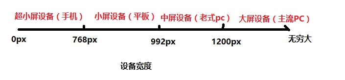
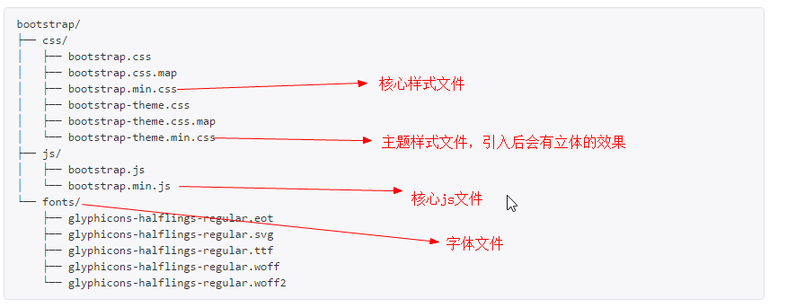
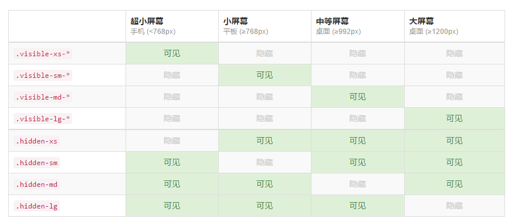

# 响应式

## 什么是响应式布局

> 响应式布局（respond layout）是Ethan Marcotte在2010年5月份提出的一个概念，简而言之，就是**一个网站能够兼容多个终端** ——而不是为每个终端做一个特定的版本。这个概念是为解决移动互联网浏览而诞生的。


**为什么要有响应式布局？** 

- 在移动互联日益成熟的时候，在PC端开发的网页已经无法满足移动设备的要求。
- 通常的做法是针对移动端单独做一套特定的版本。
- 如果终端越来越多，那么需要开发的版本就会越来越多（大屏设备的普及）
- **响应式布局** ：一个网站能够兼容多个终端（节约开发成本）


**优点：** 

面对不同分辨率设备灵活性强

能够快捷解决多设备显示适应问题

**缺点： **

兼容各种设备工作量大，效率低下

代码累赘，会出现隐藏无用的元素，加载时间加长

其实这是一种折中性质的设计解决方案，多方面因素影响而达不到最佳效果

一定程度上改变了网站原有的布局结构，会出现用户混淆的情况


响应式开发现状：

- 如果已经存在PC的网站了，那么一般不会使用响应式开发，而是针对移动端再开发一套系统（比如京东、淘宝）
- 在**新建站点** 上采用响应式开发的越来越多。
- 在国内，响应式开发还不是特别的流行。但响应式开发是大势所趋，会越来越流行。

## 响应式开发与移动web开发的比较

| 开发方式 | 移动web开发+pc开发               | 响应式开发              |
| ---- | -------------------------- | ------------------ |
| 引用场景 | 一般已经有了PC端网站，只需要端独开发移动端网站即可 | 针对一些新建网站，并且要求适配移动端 |
| 开发   | 针对性强，开发效率高                 | 兼容各种终端，效率低         |
| 适配   | 只能适配移动端或者PC端，pad上体验比较差     | 可以适配各种终端           |
| 效率   | 代码简介，加载快                   | 代码相对复杂，加载慢         |


```javascript
//思考：响应式开发的原理是什么？
```

# 媒体查询

> 媒体查询（Media Query）是CSS提出来的一个新的属性，通过媒体查询可以查询到screen的宽度，从而指定某个宽度区间的网页布局。


## 设备分类

| 分类    | 宽度范围         |
| ----- | ------------ |
| 大屏设备  | >1200px      |
| 中屏设备  | 992px~1200px |
| 小屏设备  | 768px~992px  |
| 超小屏设备 | < 768px      |





## 媒体查询的使用

需求：

```html
<!--
需求：
    大屏设备(>1200px)   版心：1170px   背景色：红色
    中屏设备(992-1200)  版心：970px    背景色：蓝色
    小屏设备(768-992)   版心：750px    背景色：黄色
    超小屏设备(<768px)  版心：100%     背景色：绿色
-->
```

**响应式开发的原理：使用媒体查询实现不同终端的布局和样式的切换。**


媒体查询语法：

```css
/*查询屏幕*/
@media screen and 条件 {
}

/*条件的写法*/
/*min-width:只要屏幕宽度超过这个值的设备样式就能生效*/
/*max-width:只要屏幕宽度小于这个值的设备样式就能生效*/
@media screen and (min-width: 1200px) {
  .container {
    width: 1170px;
    background-color: red;
  }
}

@media screen and (min-width: 992px) and (max-width: 1200px) {
  .container {
    width: 970px;
    background-color: blue;
  }
}

@media screen and (min-width: 768px) and (max-width: 992px) {
  .container {
    width: 750px;
    background-color: yellow;
  }
}

@media screen and (max-width: 768px) {
  .container {
    width: 100%;
    background-color: green;
  }
}
```

**弊端：现在只有一个div，要做一套响应式布局，就需要如此多的代码，非常的麻烦，因此我们会更多的借助一些响应式的框架，比如bootstrap。**

# bootstrap框架

> Bootstrap，来自 Twitter，是目前很受欢迎的前端框架。Bootstrap 是基于 HTML、CSS、JAVASCRIPT 的，它简洁灵活，使得 Web 开发更加快捷。

[bootstrap中文网](http://www.bootcss.com/)

特点：

- 组件简洁大方、代码规范精简、界面自定义性强。
- ​Bootstrap是基于HTML5和CSS3开发的，它在jQuery的基础上进行了更为个性化和人性化的完善，形成一套自己独有的网站风格，并兼容大部分jQuery插件。
- ​Bootstrap中包含了丰富的Web组件，根据这些组件，可以快速的搭建一个漂亮、功能完备的网站。


优点：

- 有自己的生态圈，不断的更新迭代
- 提供了一套简洁、直观、强悍的组件
- 标准化的HTML+CSS编码规范
- 让开发更简单，提高了开发效率。
- 扩展性强，虽然界面组件样式已经定义好了，我们还可以自定义，修改默认样式。

版本：

- 2.x.x 停止维护
  - 优点：兼容性好
  - 缺点：代码不够简洁、功能不够完善
- 3.x.x **目前使用最多**
  - 优点：稳定，偏向于开发响应式布局，移动设备优先的WEB项目
  - 缺点：放弃了IE67，对IE8支持但是界面效果不友好
- 4.x.x 测试阶段


## 基本模板

目录结构说明



```html
<!DOCTYPE html>
<!--使用HTML5文档，使用中文简体-->
<html lang="zh-CN">
<head>
  <!--meta1. 使用utf-8编码-->
  <meta charset="utf-8">
  <!--meta2. 当前页面在在IE浏览器访问时，使用最新的ie浏览器内核进行渲染-->
  <meta http-equiv="X-UA-Compatible" content="IE=edge">
  <!--meta3. 视口设置-->
  <meta name="viewport" content="width=device-width, initial-scale=1, user-scalable=no">
  <!-- 上述3个meta标签*必须*放在最前面，任何其他内容都必须跟随其后！ -->
  <title>bootstrap基本模板</title>
  
  <!--引入bootstrap的核心样式文件-->
  <link href="lib/bootstrap/css/bootstrap.min.css" rel="stylesheet">
  
  <!-- html5shiv是用来解决IE8以下浏览器不支持HTML5语义化标签的问题 -->
  <!--respond是用来解决IE8以下浏览器不支持媒体查询的问题，注意：respond不支持file协议打开-->
  <!--条件注释：IE浏览器专属-->
  <!--[if lt IE 9]>
  <script src="lib/html5shiv/html5shiv.min.js"></script>
  <script src="http://cdn.bootcss.com/respond.js/1.4.2/respond.min.js"></script>
  <![endif]-->
</head>
<body>
<h1>你好，世界！</h1>

<!--bootstrap依赖与jquery，因此需要在bootstrap之前引入jquery文件-->
<script src="lib/jquery/jquery-1.12.4.js"></script>
<!--引入bootstrap的核心js文件-->
<script src="lib/bootstrap/js/bootstrap.min.js"></script>
</body>
</html>
```


## 全局样式

### normalize.css 

> Normalize.css是一种CSS reset的替代方案。经过@necolas和@jon_neal花了几百个小时来努力研究不同浏览器的默认样式的差异，这个项目终于变成了现在这样。

[官网](http://necolas.github.io/normalize.css/)

[github网址](https://github.com/necolas/normalize.css)

normalize的特点：

- **保护有用的浏览器默认样式**而不是完全去掉它们
- **一般化的样式**：为大部分HTML元素提供
- **修复浏览器自身的bug**并保证各浏览器的一致性
- **优化CSS可用性**：用一些小技巧

**`Normalize.css`支持包括手机浏览器在内的超多浏览器，同时对HTML5元素、排版、列表、嵌入的内容、表单和表格都进行了一般化。尽管这个项目基于一般化的原则，但我们还是在合适的地方使用了更实用的默认值。**

[Normalize.css与CSS reset区别](http://www.cnblogs.com/webpush/p/4974063.html)

### container容器

Bootstrap 需要为页面内容和栅格系统包裹一个 .container 容器。默认带了15px的padding值。

`.container` 类用于固定宽度并支持响应式布局的容器。

```html
<div class="container">
  ...
</div>
```

`.container-fluid` 类用于 100% 宽度，占据全部视口（viewport）的容器。

```html
<div class="container-fluid">
  ...
</div>
```

**这两种 容器类不能互相嵌套。** 


### 栅格系统

栅格系统，也叫网格系统

- `.row`用于抵消`.container`容器的15px的padding值
- 可以在`.row`中嵌套`column`


栅格系统常用类（总共12列）

| 类名         | 例子        | 解释           |
| ---------- | --------- | ------------ |
| .col-xs-xx | .col-xs-6 | 在超小屏幕（及以上）生效 |
| .col-sm-xx | .col-sm-6 | 在小屏幕（及以上）生效  |
| .col-md-xx | .col-md-6 | 在中屏幕（及以上）生效  |
| .col-lg-xx | .col-lg-3 | 在大屏幕及生效，占1/4 |
| .col-lg-xx | .col-lg-4 | 在大屏幕及生效，占1/3 |
| .col-lg-xx | .col-lg-5 | 在大屏幕及生效，占1/2 |

【案例：响应式栅格系统】

```html
<!--
需求：
  1. 在大屏时显示6个等分的列
  2. 在中屏时显示4个等分的列
  3. 在小屏时显示3个等分的列
  4. 在超小屏时显示2个等分的列
-->
```

【案例：列嵌套.html】

```html
<div class="col-lg-4">
      <!--栅格系统无处不在，只要父盒子有宽度，就可以使用栅格系统-->
      <div class="row">
        <div class="col-lg-6"></div>
        <div class="col-lg-6"></div>
      </div>
    </div>
```

【案例：列偏移.html】

```html
<!-- 使用 .col-md-offset-* 类可以将列向右侧偏移。-->
<div class="row">
  <div class="col-lg-3"></div>
  <!--col-lg-offset-3:在大屏下，这个div将向右侧偏移3个单位-->
  <div class="col-lg-6 col-lg-offset-3"></div>
</div>
```


【案例：列排序.html】

```html
<div class="row">
  <!--col-lg-push-9:往后推9格-->
  <!--col-lg-pull-3:往前拉3格-->
  <div class="col-lg-3 col-lg-push-9"></div>
  <div class="col-lg-9 col-lg-pull-3"></div>
</div>
```


### 响应式工具

```javascript
//1. 大屏显示
//2. 中屏不显示
//3. 小屏显示
//4. 超小屏不显示
```



**推荐使用hidden相关的属性**


### 其他

bootstrap内置的东西是在太多，不可能每一个都详细的讲，但是bootstrap文档简洁明了，当我们用到了相关的东西的时候，再来详细的进行讲解。


# 微金所

## 目录结构

- wjs.............项目文件夹
  - js...................js文件目录      
  - lib..................第三方框架目录
  - images...............图片文件目录
  - css..................css文件目录
  - fonts..............字体图标目录
  - favicon.ico..........网站图标
  - index.html...........站点入口

引入字体图标

```html
<link rel="icon" href="favicon.ico" type="image/x-icon" />
```


## 页面结构

```html
<!--头部开始-->
<div class="wjs_header"></div>
<!--头部结束-->

<!--导航开始-->
<div class="wjs_nav"></div>
<!--导航结束-->

<!--轮播图开始-->
<div class="wjs_banner"></div>
<!--轮播图结束-->

<!--信息开始-->
<div class="wjs_info"></div>
<!--信息结束-->

<!--产品开始-->
<div class="wjs_product"></div>
<!--产品结束-->

<!--新闻开始-->
<div class="wjs_news"></div>
<!--新闻结束-->

<!--合作伙伴开始-->
<div class="wjs_partner"></div>
<!--合作伙伴结束-->
```

## 自定义字体图标

**1.定义font-family**

```css
@font-face {
  font-family: 'wjs_fonts';
  src: url('../fonts/MiFie-Web-Font.eot'); /* IE9*/
  src: url('../fonts/MiFie-Web-Font.eot#iefix') format('embedded-opentype'), /* IE6-IE8 */
  url('../fonts/MiFie-Web-Font.woff') format('woff'), /* chrome, firefox */
  url('../fonts/MiFie-Web-Font.ttf') format('truetype'), /* chrome, firefox, opera, Safari, Android, iOS 4.2+*/
  url('../fonts/MiFie-Web-Font.svg#iconfont') format('svg'); /* iOS 4.1- */
}
```

**2.定义wjs_icon类**

```css
.wjs_icon {
  font-family: 'wjs_fonts';
}
```

**3.使用伪元素定义对应的图标类**

```css
.wjs_icon_phone::before {
  content: "\e908";
}

.wjs_icon_tel::before {
  content: "\e909";
}
```

**4.使用字体图标**

```html
<i class="wjs_icon wjs_icon_phone"></i>
```

